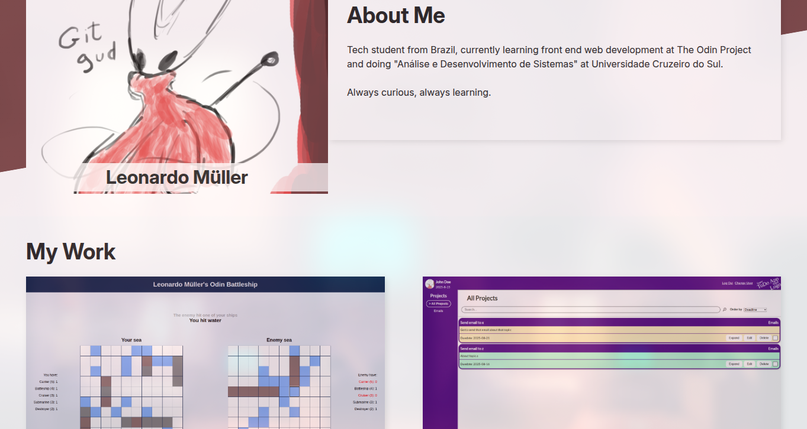

# Responsive Homepage

A fully responsive homepage project build with **HTML**, **CSS**, and **JavaScript**, following [The Odin Projects](https://theodinproject.com) curriculum. This page adapts to desktop, tablet, and mobile devices, and dynamically loads projects from JavaScript.

## Features

- Responsive design using Flexbox, CSS Grid, and media queries;
- Dynamic project cards generated from JavaScript;
- Accessible markup with ```aria-label```s, descriptive alt text, and proper heading structure;
- Custom color pallete and typography using ```Inter``` font;
- Optimized images and lazy loading for better performance;
- External links to GitHub repositories and live demos.

## Screenshots

### Desktop View


### Tablet view


### Mobile View


## Technologies used

- HTML 5 - semantic structure;
- CSS3 - Flexbox, Grid, CSS variables, media queries;
- JavaScript (ES6+) - DOM manipulation, dynamic rendering;

## Learning Goals

- Practice responsive design for multiple screen sizes;
- Apply semantic HTML for better accessibility and SEO;
- Use CSS Grid & Flexbox for layout control;
- Improve JavaScript DOM manipulation skills;

## Live Demo

[View it on GitHub Pages](https://lemuller04.github.io/odin-homepage)
